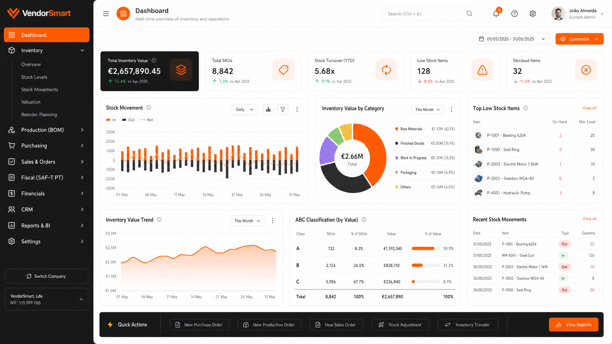

# 🛒 VendorSmart Enterprise

> **A solução definitiva para gestão de inventário, produção e conformidade fiscal (SAF-T PT).**

[](package.json)
[](server/services/saft.service.ts)
[](src/styles.css)



## 🚀 Visão Geral

O **VendorSmart Professional** é um sistema ERP de gestão de inventário de alto desempenho, desenhado para empresas que exigem precisão, rastreabilidade e conformidade legal. Mais do que um simples gestor de stock, o VendorSmart oferece um ecossistema completo para gerir o ciclo de vida dos produtos, desde a produção até à venda final.

### ✨ Diferenciais Profissionais

- 🇵🇹 **Conformidade SAF-T PT**: Geração nativa do ficheiro de auditoria fiscal para Portugal.
- 🔬 **Rastreabilidade por Lotes**: Gestão avançada de validades e números de série (RF06).
- 🏗️ **Bill of Materials (BOM)**: Suporte completo para artigos compostos e controlo de produção (RF04).
- 📊 **Gestão Financeira**: Contas-correntes de clientes e fornecedores com emissão de documentos (RF02/03).
- ⚖️ **Motor de Impostos**: Configuração flexível de taxas (IVA) por país e categoria (RF10).
- 🏢 **Multi-Localização**: Gestão de armazéns e transferências entre áreas especializadas.

---

## 📸 Interface Profissional

### Dashboard de Inteligência

*Visão consolidada de métricas, anomalias de stock e tendências de mercado.*

### Gestão de Produção (BOM)

*Crie produtos complexos e controle o consumo de matérias-primas automaticamente.*

### Auditoria e Conformidade

*Exporte o SAF-T PT e relatórios contabilísticos com um clique.*

---

## ⚙️ Parâmetros Avançados de Exportação

O VendorSmart Professional introduz um motor de relatórios de nível empresarial:

- **Metadados de Documento**: Título, Autor e Empresa personalizados em cada exportação.
- **Configuração de Margens**: Controle milimétrico para faturas e guias de remessa.
- **Qualidade Industrial**: Exportação de relatórios em PDF de alta resolução (300 DPI) para impressão.
- **Formatos Versáteis**: Suporte para XML (SAF-T), CSV, XLSX e JSON.

---

## 🏗️ Arquitetura Técnica

- **Frontend**: React 19 + Vite + Tailwind CSS (Design System Profissional).
- **Backend**: Node.js Enterprise + Express + Drizzle ORM.
- **Base de Dados**: SQLite (Desenvolvimento) / SQL Server Ready.
- **Segurança**: RBAC (Role-Based Access Control) com 5 níveis de privilégios.

---

## ⚡ Instalação Rápida

```bash
# Clonar o repositório
git clone https://github.com/cody007cyberdev-blip/vendorsmart.git

# Instalar dependências
npm install

# Iniciar ambiente de desenvolvimento
npm run dev
```

---

## 📚 Requisitos Funcionais Implementados (v3.0)

| ID | Requisito | Descrição |
|---|---|---|
| **RF04** | Controlo de Produção | Gestão de artigos compostos (BOM). |
| **RF06** | Rastreabilidade | Controlo de lotes e datas de validade. |
| **RF10** | Impostos | Discriminação de IVA em todos os movimentos. |
| **RF11** | SAF-T PT | Geração de ficheiro XML para Autoridade Tributária. |
| **RF02** | Financeiro | Gestão de contas-correntes e saldos. |

---

**Desenvolvido para profissionais que não aceitam menos que a excelência.**
*VendorSmart — Smart Inventory, Smarter Business.*
