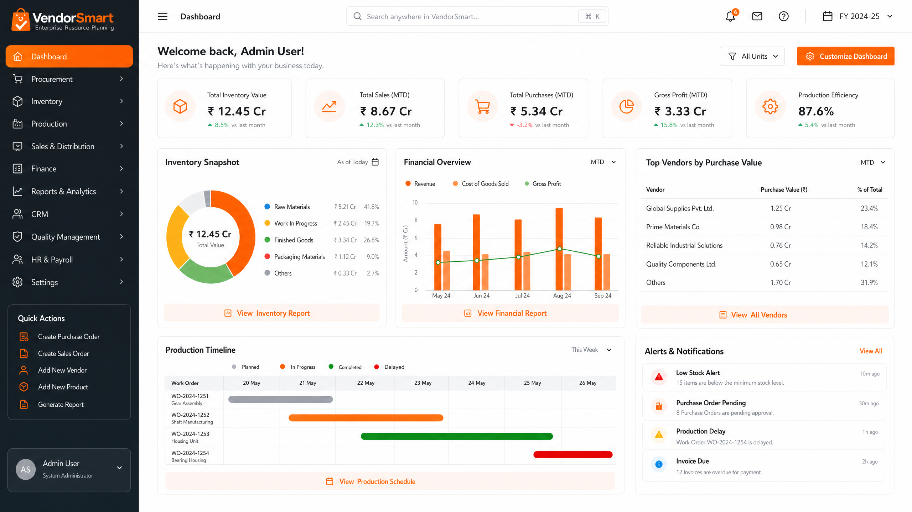
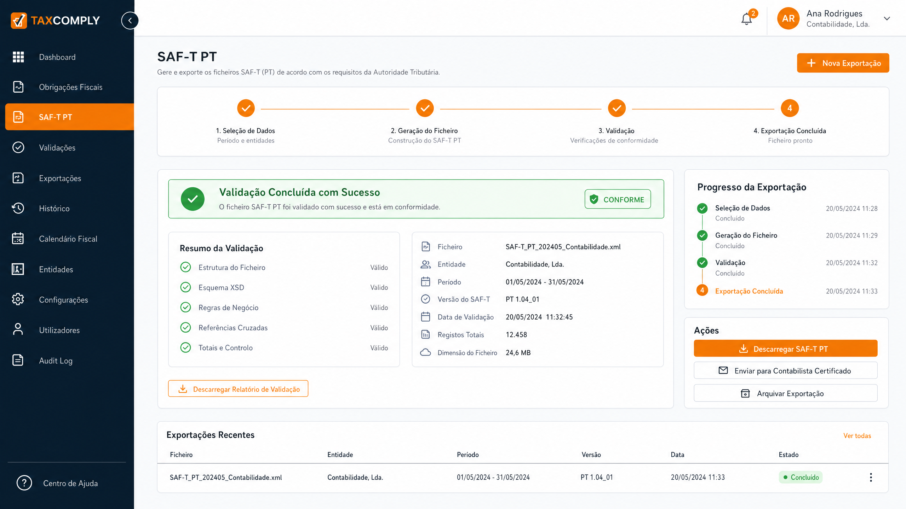
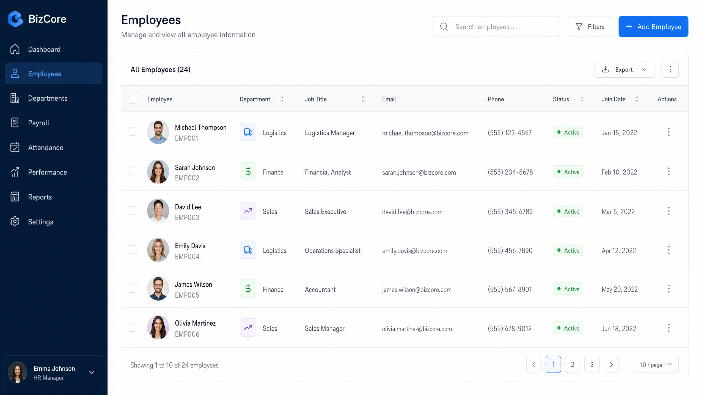

# 🚀 VendorSmart Professional Enterprise v3.0

[](LICENSE)
[](package.json)
[](#localização-e-conformidade)

O **VendorSmart Professional Enterprise** é uma solução ERP de próxima geração, desenhada para empresas que exigem alto desempenho, conformidade fiscal rigorosa e uma experiência de utilizador de elite. Transformamos a gestão de inventário básica numa plataforma robusta que cobre todo o ciclo operacional, da produção ao financeiro.

---

## 💎 Experiência de Utilizador de Elite

A nossa nova interface foi redesenhada do zero para oferecer clareza, velocidade e elegância. Com um tema **Enterprise Clean** (Preto, Laranja e Branco), o VendorSmart proporciona um ambiente de trabalho produtivo e moderno.


*Dashboard em tempo real com métricas de inventário, financeiras e cronogramas de produção.*

### ✨ Destaques da Interface:
- **Sidebar Inteligente**: Sistema de navegação recolhível para maximizar o seu espaço de trabalho.
- **Header Dual-Layer**: Acesso rápido a perfis de utilizador (Leonardo/João), notificações e pesquisa global com atalhos de teclado (⌘K).
- **Playground Interativo**: Visualize transformações de dados e documentos em tempo real.

---

## 🏗️ Funcionalidades Core Enterprise

### 📦 Gestão de Inventário e Produção (BOM)
Controlo total sobre o seu catálogo. Defina fórmulas de produção (Bill of Materials), gira lotes e datas de validade, e automatize o planeamento de reabastecimento.

### 🏛️ Localização e Conformidade Fiscal
O VendorSmart está totalmente adaptado para os mercados de **Portugal** e **Cabo Verde**.
- **SAF-T PT**: Gerador de ficheiro SAF-T (PT) integrado para conformidade total com a Autoridade Tributária.
- **NIF e Moedas**: Suporte nativo para NIF (PT/CV) e moedas (EUR/CVE).
- **Regimes de IVA**: Configuração flexível de taxas e regimes de isenção.


*Módulo de conformidade fiscal com validação e exportação de SAF-T PT.*

### 👥 Gestão de Capital Humano e Clientes
Tabelas avançadas para gestão de funcionários e clientes, com rastreio de performance, limites de crédito e saldos de conta-corrente.


*Interface de gestão de funcionários com departamentos e status em tempo real.*

---

## ⚙️ Parâmetros Avançados de Exportação

O nosso motor de exportação profissional permite gerar documentos prontos para o mercado:
- **Metadados Personalizados**: Título, Autor e Empresa integrados nos documentos.
- **Controlo de Margens**: Ajuste milimétrico para impressão perfeita.
- **Alta Fidelidade**: Exportações em 300 DPI para máxima qualidade.

---

## 🚀 Começar Agora

### Pré-requisitos:
- Node.js v18+
- SQLite / PostgreSQL
- Ligação à Internet para validações fiscais

### Instalação:
```bash
# Clonar o repositório
git clone https://github.com/cody007cyberdev-blip/vendorsmart.git

# Instalar dependências
pnpm install

# Iniciar em modo de produção
pnpm run build && pnpm run start
```

---

## 📞 Contacto e Suporte

O VendorSmart Professional Enterprise é uma solução de elite para empresas de elite. Para licenciamento ou suporte personalizado, entre em contacto com a nossa equipa de vendas.

---
*© 2026 VendorSmart, Lda. Todos os direitos reservados.*
